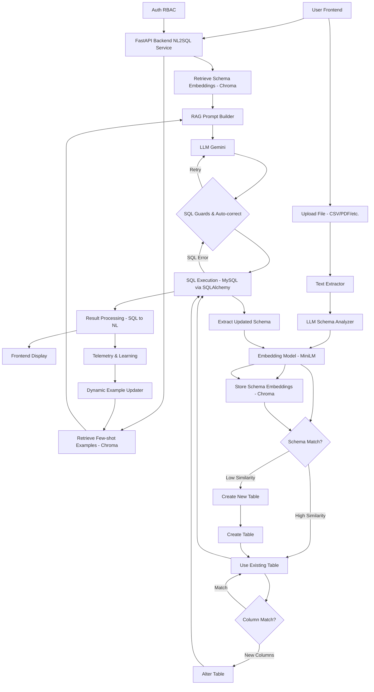

# Query Based Reports

*Transform your Excel data into intelligent, queryable insights*

---
## Complete Project Demo and Explanation


https://youtu.be/5Ied6-Ck5FE

---

## What This Does?

Ever wished you could just ask your spreadsheets questions and get smart answers back? That's exactly what this project does. Drop in an Excel, PDF amd the data will be stored dynamically in the relevant table and column and Ask any query and right data for the answer will be retrieved from the DB . 

---

## How It Works

**1. Data Ingestion** → Your Excel files get processed and stored in a proper SQL database. 
  So any Data in Pdf or Excel (csv , xlsxx etc) can be interpretted and stored in their relevant tables in that database matching the content and primary identifiers and then actual data can be stored based on similairty with the existing column of the table or new      column. 
  
**2. AI Analysis** → Ask questions in plain English and get intelligent answers about your data
  So any NLP query sent by the user , first relevant tables are found by the ChromaDB vectordb based similarity matching then inside the relevant tables the relevant columns for the query are checked , after which the sql query is formed to retireve the result data      which then can also be converted back to NLP 

Think of it as giving your spreadsheets a brain.

---

## 📂 Dataset Format Requirements & Supported Patterns

```
Testing Data is in the folder 

root
|-- Testing Dataset
|   |-- Main_Test_Dataset
|   |   |-- chrome
|   |   |   |-- Chrome_Dataset.csv
|   |   |   |-- File1_2008_2011.csv
|   |   |   |-- File1_2008_2011.pdf

```

### 📌 Overview

The system supports multiple data formats, but its performance depends heavily on how structured the input data is.

> ⚠️ For best results, datasets should follow a **clear tabular structure** similar to relational database schemas.

---

### ✅ 1. Preferred Format (Highly Recommended)

Structured tabular data (e.g., Excel/CSV) with clearly defined columns.

#### ✔️ Example (Supported Format)

| Year | Key Achievement | Adoption/Usage | Technical Challenges | Business/Cost Impact |
|------|----------------|---------------|---------------------|----------------------|
| 2012 | Became most-used browser | Market share increased | Memory footprint | Increased ad revenue |
| 2013 | Chrome Apps launched | Improved adoption | Offline limitations | Ecosystem growth |

✔ This format ensures:
- Accurate schema inference  
- Better embedding generation  
- Reliable NL → SQL conversion  

---

### ✅ 2. Supported Semi-Structured Format (Conditionally Supported)

The system can also process narrative or timeline-style data, such as:

#### ✔️ Example

``` 

Google Chrome 
In recent years, Chrome emphasized privacy controls and AI-enhanced productivity.

2020 — Introduced tab grouping and performance throttling.
2021 — Improved privacy controls and launched Manifest V3.
2022 — Enhanced memory efficiency and introduced Journeys feature.
2023 — Wider adoption among students and professionals.

```


✔ This works because:
- The system uses **LLM-based parsing + chunking**
- Temporal patterns (years, events) can be inferred into structured form

---

### ⚠️ Important Limitation

> Semi-structured formats are **less reliable** than tabular formats.

Possible issues:
- Incorrect column inference  
- Missing attributes (e.g., cost, adoption not clearly stated)  
- Inconsistent schema across chunks  

---

### ❌ Unsupported / High-Risk Inputs

- Completely unstructured paragraphs without patterns  
- Data without consistent entities (e.g., mixed topics)  
- Missing temporal or categorical structure  
- No identifiable schema or repeated structure  

---

### 🧠 How the System Interprets Different Formats

| Input Type | Processing Behavior | Reliability |
|-----------|------------------|------------|
| Structured Tables | Direct schema mapping | ⭐⭐⭐⭐⭐ |
| Semi-Structured (Timelines, Logs) | Chunking + LLM inference | ⭐⭐⭐ |
| Unstructured Text | Weak schema inference | ⭐ |

---

### 🛠️ Recommendation

For **best accuracy and stability**:

- ✔ Use Excel/CSV with clear columns  
- ✔ Ensure consistent formatting across rows  
- ✔ Avoid mixing multiple data types in one file  
- ✔ Use semi-structured text only when necessary  

---

### 💡 Key Insight

> The system is not just format-driven — it is **structure-driven**.  
> The clearer the structure, the better the performance.


---
## Project Workflow


## User Query Flow





---

## 4.1 Data Ingestion Pipeline

When a user uploads a file, a **multi-stage intelligent ingestion pipeline** is triggered to transform unstructured or semi-structured data into queryable database schemas.

### 🔄 Pipeline Overview (Enhanced with Chunking & Embedding Optimization)

| Stage | Step | Detail |
|------|------|--------|
| 1 | File Upload | User uploads file (Excel / CSV / PDF ) via Streamlit UI |
| 2 | Text Extraction | Format-specific parsers (e.g., pdfplumber, pandas) extract raw content, headers, and structure |
| 3 | Chunking (NEW) | Large documents are split into semantic chunks to preserve context and improve LLM understanding |
| 4 | Schema Inference | Gemini LLM analyzes extracted chunks to infer table name, column names, and data types |
| 5 | Schema Consolidation (NEW) | Chunk-level schemas are merged into a unified global schema representation |
| 6 | Schema Embedding | MiniLM model generates vector embeddings from the inferred schema description |
| 7 | Schema Matching | Embedding is compared (cosine similarity) against existing schema embeddings in ChromaDB |
| 8a | Existing Table Path | If similarity ≥ `TABLE_THRESHOLD`: <br>• Insert data into existing table <br>• Detect schema drift → apply `ALTER TABLE` if needed |
| 8b | New Table Path | If similarity < `TABLE_THRESHOLD`: <br>• Create new table using inferred schema <br>• Insert data via SQLAlchemy |
| 9 | Data Insertion Optimization (NEW) | Batch inserts + type normalization for efficient storage |
| 10 | Schema Refresh | Final schema re-read from DB and embeddings updated in ChromaDB |
| 11 | Metadata Logging (NEW) | Store ingestion metadata (source, timestamp, schema version) for traceability |

---

## 4.2 NL2SQL Query Pipeline

When a user submits a natural language query, a **robust AI-powered query pipeline** executes to generate, validate, and return results.

### ⚡ Pipeline Overview (Enhanced with RAG, Validation & Voice Input)

| Stage | Step | Detail |
|------|------|--------|
| 1 | Query Input | User enters query via text |
| 2 | Auth / RBAC | Role-Based Access Control validates user permissions and restricts accessible databases |
| 3 | Query Preprocessing (NEW) | Clean and normalize input (remove noise, handle synonyms, basic intent shaping) |
| 4 | Query Embedding | MiniLM model converts user query into a 384-dimensional vector embedding |
| 5 | Schema Retrieval (RAG) | Top-k relevant tables and columns retrieved from ChromaDB using cosine similarity |
| 6 | Few-Shot Retrieval (RAG) | Top-k similar historical NL→SQL examples retrieved from few-shot vector store |
| 7 | Context Chunk Selection (NEW) | Relevant schema chunks are selected to reduce token usage and improve accuracy |
| 8 | Prompt Construction | RAG Prompt Builder assembles: <br>• User query <br>• Retrieved schema context <br>• Few-shot examples |
| 9 | SQL Generation | Prompt sent to Gemini 2.5 Flash → LLM generates SQL query |
| 10 | SQL Validation (Guardrails) | Enforces read-only constraints: <br>• Blocks DROP / DELETE / UPDATE <br>• Fixes syntax via retry <br>• Prevents unsafe queries |
| 11 | SQL Execution | Validated SQL executed via SQLAlchemy on MySQL |
| 12 | Result Serialization | DataFrame cleaned (NaN, datetime, types) and converted to JSON-safe format |
| 13 | Post-Processing | Optional SQL→NL summarization using LLM |
| 14 | Visualization | Results displayed via tables + Plotly charts |
| 15 | Feedback Loop (NEW) | Query + SQL pair stored for improving few-shot retrieval over time |

---

## 🔐 Safety & Optimization Layers

### ✅ Query Safety
- Read-only SQL enforcement (SELECT / SHOW / EXPLAIN only)
- Multi-layer validation (regex + execution guardrails)

### ⚡ Performance Optimizations
- Global embedding model loading (avoids repeated initialization)
- Chunk-based RAG (reduces token usage)
- Cached schema embeddings (ChromaDB)

### 🧠 Intelligence Enhancements
- Few-shot learning with dynamic retrieval
- Schema-aware prompt construction
- Automatic schema evolution handling

---

## Project Structure

```
QueryBasedReports/
│
|-- .env
|-- .gitignore
|-- Meeting_ppts.zip
|-- README.md
|-- Testing Dataset
|   |-- Main_Test_Dataset
|   |   |-- chrome
|   |   |   |-- Chrome_Dataset.csv
|   |   |   |-- File1_2008_2011.csv
|   |   |   |-- File1_2008_2011.pdf
|   |   |   |-- File2_2012_2015.csv
|   |   |   |-- File2_2012_2015.pdf
|   |   |   |-- File3_2016_2019.csv
|   |   |   |-- File3_2016_2019.pdf
|   |   |   |-- File4_2020_2023.csv
|   |   |   |-- File4_2020_2023.pdf
|   |   |   |-- chrome_dataset_v2.pdf
|   |   |-- teams
|   |   |   |-- Book1.xlsx
|   |   |   |-- Book2.xlsx
|   |   |   |-- Book3.xlsx
|   |   |   |-- Book4.xlsx
|   |   |   |-- File1.pdf
|   |   |   |-- File2.pdf
|   |   |   |-- File3.pdf
|   |   |   |-- File4.pdf
|   |   |   |-- Teams_Dataset.csv
|   |   |   |-- teams_dataset_v2.pdf
|   |   |-- whatsapp
|   |   |   |-- Book1.xlsx
|   |   |   |-- Book2.xlsx
|   |   |   |-- Book3.xlsx
|   |   |   |-- Book4.xlsx
|   |   |   |-- File1_2009_2012.pdf
|   |   |   |-- File2_2013_2016.pdf
|   |   |   |-- File3_2017_2020.pdf
|   |   |   |-- File4_2021_2024.pdf
|   |   |   |-- Whatsapp_Dataset.csv
|-- backend
|   |-- app
|   |   |-- models
|   |   |   |-- query.py
|   |   |-- routes
|   |   |   |-- db_meta.py
|   |   |   |-- debug_chroma.py
|   |   |   |-- execute_query.py
|   |   |   |-- intelligent_ingest.py
|   |   |   |-- nl2sql.py
|   |   |   |-- refresh_schema.py
|   |   |   |-- summarize.py
|   |   |   |-- upload_excel.py
|   |   |-- services
|   |   |   |-- intelligent_ingestion_service.py
|   |   |   |-- nl2sql_service.py
|   |   |   |-- summarize_service.py
|   |   |   |-- upload_service.py
|   |-- chroma_examples
|   |   |-- fewshot_examples
|   |-- chroma_schemas
|   |-- main.py
|   |-- utils
|   |   |-- chroma_utils.py
|   |   |-- db.py
|   |   |-- db_utils.py
|   |   |-- fewshot_utils.py
|   |   |-- sql_readonly_validator.py
|-- docker-compose.yml
|-- frontend
|   |-- app.py
|   |-- assets
|   |   |-- styles.css
|   |-- components
|   |   |-- data_ingestion.py
|   |   |-- file_upload.py
|   |   |-- followup.py
|   |   |-- nl_query.py
|   |   |-- result_viewer.py
|   |   |-- sidebar.py
|   |   |-- sql_editor.py
|   |   |-- voice_input_component
|   |-- utils
|   |   |-- api.py
|-- requirements.txt

```
---

## Installation

### Prerequisites

- Docker & Docker Compose
- Python 3.10+
- MySQL
- Gemini API Key

### Setting up the project

1. **Clone the repository**
   ```bash
   git clone https://github.ecodesamsung.com/SRIB-PRISM/QueryBasedReports.git
   cd QueryBasedReports
   ```

2. **Configure environment variables**
   ```bash
   cp .env.example .env
   ```
   
   Edit `.env` with your configuration:
   ```env
   # Database Configuration
   DB_HOST=localhost
   DB_PORT=3306
   DB_NAME=query_reports
   DB_USER=root
   DB_PASS=your_password
   
   # AI Configuration
   GEMINI_API_KEY=your_key_here
   ```

3. **Install Python dependencies**
   ```bash
   pip install -r requirements.txt
   ```

4. **Set up the database**
   ```bash
   # Create database
   mysql -u root -p -e "CREATE DATABASE query_reports;"
   ```
5. **Set up Virtual Environment**
   ```bash
   python3.10 -m venv venv
   # Activate the environment
   # On Windows (PowerShell / CMD):
   venv\Scripts\activate
   # On macOS / Linux:
   source venv/bin/activate

5. **Run the backend**
   ```bash
   cd backend
   uvicorn app.main:app --reload --host 0.0.0.0 --port 8000
   ```

6. **Run the frontend**
   ```bash
   cd frontend
   streamlit run app.py
   ```

---

## Usage

### 1. Upload Data Files

Navigate to the frontend UI and upload your data files:

- **Supported formats:** Excel (.xlsx, .xls), CSV, PDF, PPT, Images, Text files
- Files are automatically processed and stored in SQL tables
- Schema is extracted and indexed for intelligent querying

### 2. Query Your Data in Natural Language

Simply type questions in plain English:

```
"Show me sales for Q3"
"List all employees who joined after 2021"
"Top 10 products by revenue last month"
"Find orders where amount > 5000 and status = pending"
"What is the average salary by department?"
```

### 3. View Results

- **Tables:** Clean, formatted data tables
- **Charts:** Visual representations of data
- **Summaries:** AI-generated insights
- **SQL Editor:** View and edit generated SQL (advanced users)

---

## Technologies Used

### Backend
- **FastAPI** - Modern, high-performance web framework
- **SQLAlchemy** - SQL toolkit and ORM
- **MySQL / PostgreSQL** - Relational database
- **ChromaDB** - Vector database for embeddings
- **HuggingFace Embedding Model** - Semantic search and matching
- **Gemini LLM** - Natural language understanding

### Frontend
- **Streamlit** - Interactive Python web interface
- **REST API Integration** - Seamless backend communication

### Infrastructure
- **Docker** - Containerization
- **Docker Compose** - Multi-container orchestration

---

## Documentation

### API Endpoints

<details>
<summary>View available endpoints</summary>

#### Data Ingestion
- `POST /upload/excel` - Upload and process Excel/CSV files
- `POST /ingest/intelligent` - Intelligent data ingestion

#### Querying
- `POST /nl2sql` - Convert natural language to SQL
- `POST /execute` - Execute SQL query
- `POST /summarize` - Generate result summary

#### Schema Management
- `GET /db/meta` - Get database metadata
- `POST /refresh/schema` - Refresh schema embeddings

#### Debugging
- `GET /debug/chroma` - Debug ChromaDB collections

</details>

---

##  Troubleshooting

| Issue | Solution |
|-------|----------|
| Database not connecting | Verify `.env` configuration and ensure database is running |
| Embeddings not loading | Install required model dependencies: `pip install sentence-transformers` |
| Incorrect AI responses | Refresh schema and clear few-shot cache |
| File ingestion errors | Ensure files have proper headers and are not password-protected |
| Docker issues | Run `docker-compose down -v` then restart with `docker-compose up --build` |

*Built for intelligent data analysis and insights.*


